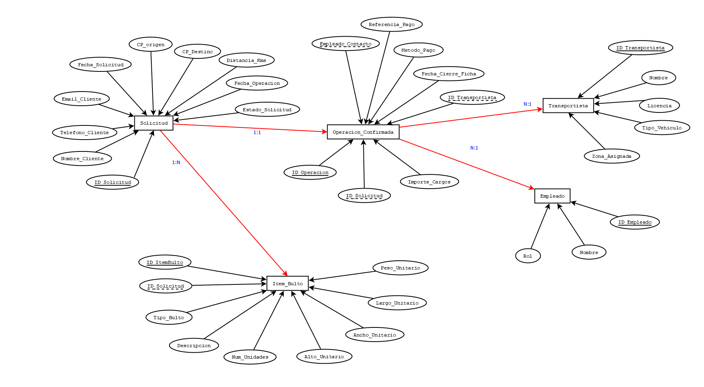

# Proyecto Final
#### Título Sistema de Gestión de Presupuestos de Transporte de Mercancías 
#### Versión 0.1.2 
#### Fecha 07 Oct. 2025

## Preamble
El proyecto final tal como fue [presentado](TemaProyectoFinalDesignBDRelacional.md) fue además de acuerdo a requerimiento, un primer borrador. Conforme he ido involucrándome en los distintos aspectos de su posible implementación he ajustado varios aspectos clave. Esta revisión probablememte no será la única pero es drástica en tanto atañe al diseño y la estructura del flow que se pretende. 

## Duplicidad de Bultos (Estandar vs ADICIONAL)
* **BULTOS** $\xrightarrow{1:N}$ **BULTO\_ADICIONAL**

**Inconveniente:** Esto sugiere que un "Bulto Estándar" (el ítem predefinido del formulario) **contiene** "Bultos Adicionales" (el ítem descrito a mano). Según la propuesta original o requerimiento, en camnio, los bultos se dividen en dos categorías **independientes** que provienen de la **misma Solicitud**:

1.  Lo que se **marca** en el formulario (`BULTO_ESTANDAR`).
2.  Lo que se **escribe** en un campo libre (`BULTO_ADICIONAL`).

**Corrección:**

* **Ambas tablas de bultos deben relacionarse directamente con SOLICITUD.**
* **Debe eliminar la relación $1:N$ entre $BULTOS$ y $BULTO\_ADICIONAL$.**

## Sobre el atributo `Num_Items` 
* **Problema:** El atributo `Num_Items` no encaja bien aquí si la intención es registrar *cada* bulto (estándar) con sus medidas específicas, a menos que asuma que todas las $N$ unidades tienen **exactamente las mismas medidas y peso**.
* **Solución (Opción A - Mejor):** Si el cliente marca "3 Cajas Grandes" en el formulario, se registra **un solo registro** en `BULTO_ESTANDAR` con:
    * `Num_Items = 3`
    * `Descripcion_Estandar = 'Caja Grande'`
    * Las medidas y peso de **una sola** Caja Grande (asumiendo homogeneidad).
  
## Conclusiones
Crearemos una única entidad, ITEM_BULTO, y utilizaremos dos atributos clave para capturar la lógica que describe:
 - Diferenciador (Tipo de Origen): Para saber si aplica el preacuerdo gremial (marcado) o necesita confirmación manual (adicional).
 - Cantidad (Num_Items): Para registrar cuántas unidades idénticas se están presupuestando con esas mismas medidas.
 
### Entidad, ITEM_BULTO, lista de atributos:
  - **ITEM\_BULTO**, **ID\_ItemBulto** (PK) | Clave Primaria.
  - **ID\_Solicitud** (FK), Relación $1:N$ con la solicitud.
  - **Tipo\_Bulto**, **NUEVA ETIQUETA:** Enum/string ('Estándar' o 'Adicional').
  - **Descripción**, Nombre del ítem (ej. 'Caja Pequeña' o 'Mesa de Comedor').
  - **Num\_Unidades**, **NUEVO NOMBRE:** Número de ítems idénticos con las mismas medidas (ej. 3 lámparas).
  - **Peso\_Unitario**, Peso de **una sola** unidad (para calcular el total).
  - **Largo\_Unitario**, Largo de **una sola** unidad.
  - **Ancho\_Unitario**, Ancho de **una sola** unidad.
  - **Alto\_Unitario**, Alto de **una sola** unidad.

### Escenario de Uso:   
| Lógica de Formulario | Datos Registrados en ITEM\_BULTO |
| :--- | :--- |
| El cliente marcó: **3 Cajas Grandes (Tipo Estándar)** | `Tipo_Bulto = 'Estándar'`, `Descripción = 'Caja Grande'`, **`Num_Unidades = 3`**, `Peso_Unitario = 15kg`, `Largo_Unitario = 50cm`, etc. |
| El cliente agregó a mano: **1 Mesa de Oficina (Tipo Adicional)** | `Tipo_Bulto = 'Adicional'`, `Descripción = 'Mesa de Oficina'`, **`Num_Unidades = 1`**, `Peso_Unitario = 40kg`, `Largo_Unitario = 160cm`, etc. |
| El cliente agregó a mano: **2 Lámparas Idénticas (Tipo Adicional)** | `Tipo_Bulto = 'Adicional'`, `Descripción = 'Lámpara de Pie'`, **`Num_Unidades = 2`**, `Peso_Unitario = 8kg`, `Largo_Unitario = 30cm`, etc. |

De esta manera, la columna **`Num_Unidades`** (`Num_Items` en términos del formulario) queda perfectamente encajada: representa el **multiplicador** de las medidas y pesos registrados, lo cual es vital para el cálculo total del volumen y el peso de la carga.

## Diagrama revisado 
#### TO-DO 
Los ajusten que se proponen a la [primera versión](img/PresupuestosTransporteERVer00.png) se presentan en esta vista:
