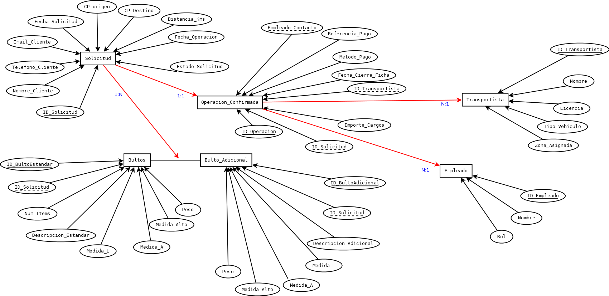

# Estructura del Sistema de Gestión de Presupuestos de Transporte

@RSilvestre Montalvo
03/Octubre/2025

## Objetivo Principal, Simplificar.
Este sistema tiene el propósito de digitalizar y optimizar la gestión de las solicitudes de presupuesto de transporte, mudanzas o envío de paquetes que recibimos a través de nuestro formulario web.

En esencia, transforma una solicitud inicial del cliente en una operación confirmada y asignada a uno de nuestros transportistas.

## Componentes Clave (Nuestra "Hoja de Ruta")

La base de datos se organiza en seis áreas o "tablas" principales, que son el esqueleto de nuestro proceso de trabajo:

|Componente (tabla)| Que recolecta?| Propósito en el Negocio|
|------------------|---------------|------------------------|
|**Solicitud**|**Datos del Cliente** y **Datos del Servicio**| Es la ficha inicial de contacto y de la necesidad del cliente.|
|**Bultos (Estándar/ Adicionales)**|El listado y las medidas de lo que el cliente quiere mover y sobre la base de una tarifa básica obtenida previamente de sondeos comerciales considerando características stándar de los items obtenido de los acuerdos tarifarios gremiales y un precio mínimo por kilometraje cargado en el propio formulario. | Permite al equipo calcular el precio del servicio y asignar el vehículo adecuado.|
|**Operación Confimada**| El **precio final acordado**, la **fecha de cierre**, el **transportista**asignado y los **detalles del pago**. | Convertir la solicitud en un servicio real y registrar la facturación y la contabilidad general del negocio.
|**Transportista** | Datos del personal y flota de vehículos, propia y de colaboradores freelance.| Saber quién está disponible para tomar el servicio.|
|**Empleado** | Datos del personal de oficina encargado de contactar ampliar detalle de los bultos y mercancías que se transportarían y cerrar el trato.| Rastrear qué empleado gestionó la confirmación de la operación.

## Flujo de Trabajo (Cómo se conectan los datos)
El proceso sigue una secuencia lógica en la base de datos.
1. **Inicio**: Cada formulario crea un registro en la tabla **SOLICITUD**.
2. **Detalle**: Inmediatamente despues, los datos sobre los paquetes se rehistran en las tablas **BULTOS**.
3. **Conversión**: Tan pronto como el equipo de ventas contacta con el cliente y se acepta el presupuesto, el registro de **SOLICITUD** se convierte en un registro en la tabla **OPERACION CONFIRMADA**.
4. **Cierre**: En esta fase de la '**OPERACION_CONFIRMADA**', se añade la ficha del **EMPLEADO** que cerró el trato y se le asigna un **TRANSPORTISTA** del equipo o del pull de colaboradors freelance.

De esta forma, garantizamos que cada dato, desde el primer email hasta el pago, este **perfectamente enlazado y rastreable**.

## Presentación de Diagrama Entidad-Relación 
|Entidad| Atributos| Descripción |
|-------|----------|-------------|
|**SOLICITUD**| **ID_Solicitud** (PK), **Nombre_Cliente**, **Telefono_Cliente**, **Email_Cliente**, **Fecha_Solicitud**, **CP_Origen**, **CP_Destino**, Distancia_Kms, Fecha_Operacion_Deseada, Estado_Solicitud (e.g., 'Pendiente', 'Confirmada', 'Cancelada')| Registra la información de contacto y detalles generales del servicio solicitado.|
|**BULTO_ESTANDAR**|**ID_BultoEstandar** (PK), **ID_Solicitud** (FK), Num_Items, Descripcion_Estandar, Medida_L, Medida_A, Medida_Alto, Peso | Almacena los bultos seleccionados de la lista predefinida del formulario.|
|**BULTO_ADICIONAL**|**ID_BultoAdicional** (PK), **ID_Solicitud** (FK), Descripcion_Adicional, Medida_L, Medida_A, Medida_Alto, Peso|Almacena los ítems descritos manualmente por el cliente.|
|**OPERACION_CONFIRMADA**|**ID_Operacion** (PK), **ID_Solicitud** (FK) (Única), Importe_Cargos, ID_Transportista (FK), Fecha_Cierre_Ficha, Metodo_Pago, Referencia_Pago, Empleado_Contacto (FK)|Ficha de cierre de la operación, solo para las solicitudes que se confirman y convierten en servicio.|
|**TRANSPORTISTA**|**ID_Transportista** (PK), Nombre, Licencia, Tipo_Vehiculo, Zona_Asignada|Datos del personal de transporte.|
|**EMPLEADO**|ID_Empleado (PK), Nombre, Rol (e.g., 'Oficina', 'Ventas')|Datos de los empleados que contactan y cierran la operación.|

## Diagrama Entidad-Relación 

